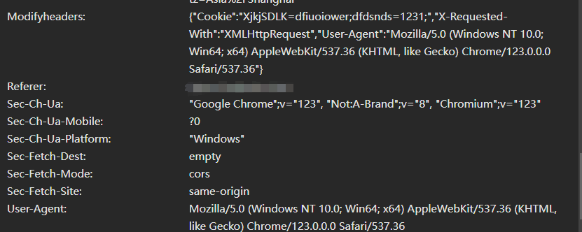
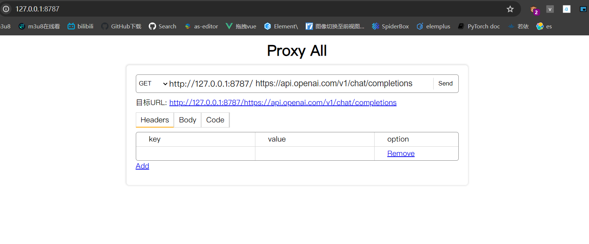
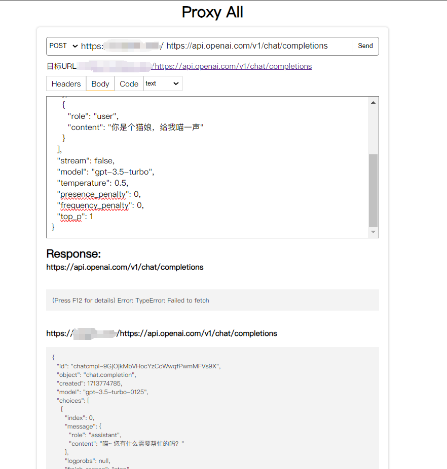

## 使用Cloudflare Workers进行反向代理

基本可以代理所有Api，支持如ChatGPT之类的。

### 使用场景

- 搭建了无服务器的静态博客，想要调用某些跨域的接口
- 反向代理国外的接口
- 访问一些页面

### 使用方法

#### 1.如果没有域名，注册域名

#### 2.把域名托管到Cloudflare

#### 3.新建Worker，复制worker.js中的内容进去

#### 4.为你的worker分配域名

他默认分配的worker_name.xxx.worker.dev在国内访问不到

#### 5.部署&使用

格式如下

```http
GET https://your.domain/https://target.url/path?some=query#elem
```

简单来说就是将要访问的地址直接加在`https://your.domain/`的后面

> Examples

假设你的Cloudflare worker域名为proxy.666.workers.dev

- Github：https://proxy.666.workers.dev/https://github.com
- Pxxnhub: https://proxy.666.workers.dev/https://pxxnhub.com

- ChatGPT Api: https://proxy.666.workers.dev/https://api.openai.com/v1/chat/completions

#### 6.关于代理api

以反代gpt为例，worker代码中，在代理请求目标网址时，会解析目标网址，自动在原请求头的基础上进行以下操作

- Host设置为api.openai.com
- Origin设置为https://api.openai.com
- Referer设置为https://api.openai.com/v1/chat/completions

如果你在html中想要用js调用接口，并修改类似Origin、Access-Control-Request-Headers等浏览器不允许设置的请求头，可以创建modifyHeaders对象，key为想要修改的请求头名称，value为想要设置的值，如：

```js
const modifyHeaders = {
    Origin: "https://example.com",
    Cookie: "XjkjSDLK=dfiuoiower;dfdsnds=1231;",
    "X-Requested-With": "XMLHttpRequest",
    "User-Agent": "Mozilla/5.0 (Windows NT 10.0; Win64; x64) AppleWebKit/537.36 (KHTML, like Gecko) Chrome/123.0.0.0 Safari/537.36"
}
```

然后在请求中**附带modifyheaders请求头，value为JSON.stringify(modifyHeaders)**，如：

```js
fetch("https://example.com/api/weather", {
    method: "POST",
    headers: {
        "Content-type": "application/json",
        // ...      一些正常能设置的请求头,
        "modifyheaders": JSON.stringify(modifyHeaders)
    },
    body: body
}).then(res => res.json()).then(res => console.log(res));
```

 

#### 7.在线测试

部署worker后，访问你worker的网址，会来到测试页面**（尽量在自己部署的网站测试，别被人家获取了信息）**

 

可以测试访问GPT对话接口：`POST https://api.openai.com/v1/chat/completions`，这是GPT对话的接口，Content-Type为application/json，body为：

```json
{
  "messages": [
    {
      "role": "system",
      "content": "\nYou are ChatGPT, a large language model trained by OpenAI.\nKnowledge cutoff: 2021-09\nCurrent model: gpt-3.5-turbo\nCurrent time: 2024/4/22 16:29:20\nLatex inline: $x^2$ \nLatex block: $$e=mc^2$$\n\n"
    },
    {
      "role": "user",
      "content": "你是个猫娘，给我喵一声"
    }
  ],
  "stream": false,
  "model": "gpt-3.5-turbo",
  "temperature": 0.5,
  "presence_penalty": 0,
  "frequency_penalty": 0,
  "top_p": 1
}
```

并且在Header中设置`Authorization: Bearer sk-xxxx`，设置你的API KEY，发送POST请求。Response中上面的那个是直接访问的结果，一般情况下要么跨域错误要么被墙，下面的是代理的结果，可以正常使用。



### 致谢

Special thanks to Cloudflare for the workers service.

感谢[netnr](https://github.com/netnr/workers)，代码基于该项目扩充
